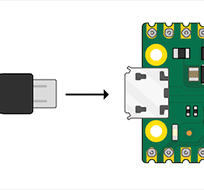
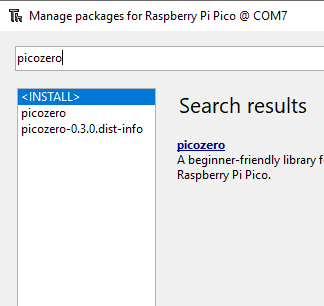
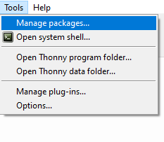

## Plug in your Raspberry Pi Pico

Connect your Rasberry Pi Pico to the computer you will use to program it. 

## Install or update MicroPython

+ Open the Thonny editor
+ Look at the bottom right-hand corner
+ Check it says 'MicroPython (Raspberry Pi Pico)'
+ If it doesn't then select 'MicroPython (Raspberry Pi Pico)'
+ You might get prompted to install the firmware.

## Add picozero

+ Go to 'Tools > Manage packages'
+ Type 'picozero' into the search bar
+ Click 'Search on PyPI'

 + Click on 'picozero' in the search results
 + Click on 'install'
 

See the [Introduction to the Raspberry Pi Pico Guide](https://projects.raspberrypi.org/en/pathways/pico-intro) for more information. 
