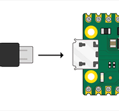

## Brancher ton Raspberry Pi Pico

Connecte ton Raspberry Pi Pico à l'ordinateur que tu utiliseras pour le programmer.

## Installer ou mettre à jour MicroPython

+ Ouvre l'éditeur Thonny
+ Regarde en bas à droite
+ Vérifie qu'il indique "MicroPython (Raspberry Pi Pico)"
+ Si ce n'est pas le cas, sélectionne "MicroPython (Raspberry Pi Pico)"
+ Tu seras peut-être invité à installer le micrologiciel.

## Ajouter picozero

+ Allez dans 'Outils > Gérer les paquets'
+ Tape 'picozero' dans la barre de recherche
+ Clique sur 'Rechercher sur PyPI'

 + Clique sur 'picozero' dans les résultats de la recherche
 + Clique sur 'installer'

Consulte l' [Introduction au guide Raspberry Pi Pico](https://projects.raspberrypi.org/en/pathways/pico-intro) pour plus d'informations. 
