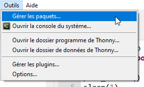

## Brancher ton Raspberry Pi Pico

Connecte ton Raspberry Pi Pico à l'ordinateur que tu utiliseras pour le programmer.

## Installer ou mettre à jour MicroPython

+ Ouvre l'éditeur Thonny
+ Regarde en bas à droite
+ Vérifie qu'il indique "MicroPython (Raspberry Pi Pico)"
+ Si ce n'est pas le cas, sélectionne "MicroPython (Raspberry Pi Pico)"
+ Tu seras peut-être invité à installer le micrologiciel.

## Ajouter picozero

+ Go to 'Tools > Manage packages'
+ Type 'picozero' into the search bar
+ Click 'Search on PyPI'

 + Click on 'picozero' in the search results
 + Click on 'install'

See the [Introduction to the Raspberry Pi Pico Guide](https://projects.raspberrypi.org/en/pathways/pico-intro){:target="_blank"} for more information. 
