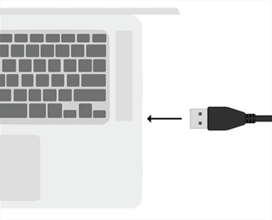
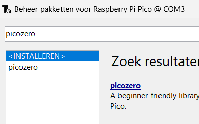
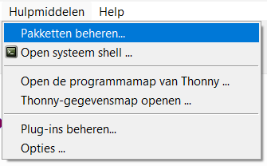

## Sluit je Raspberry Pi Pico aan

Sluit je Rasberry Pi Pico aan op de computer die je gaat gebruiken om hem te programmeren.

## Installeer of update MicroPython

+ Open de Thonny editor
+ Kijk naar de rechterbenedenhoek
+ Controleer of er 'MicroPython (Raspberry Pi Pico)' staat
+ Als dit niet het geval is, selecteer je 'MicroPython (Raspberry Pi Pico)'
+ Mogelijk word je gevraagd om de firmware te installeren.

## Voeg picozero toe

+ Ga naar 'Hulpmiddelen > Pakketten beheren'
+ Typ 'picozero' in de zoekbalk
+ Klik 'Search on PyPI'

 + Klik op picozero in de zoekresultaten
 + Klik op 'Installeren'

Zie de [Inleiding tot de Raspberry Pi Pico Gids](https://projects.raspberrypi.org/en/pathways/pico-intro){:target="_blank"} voor meer informatie. 
